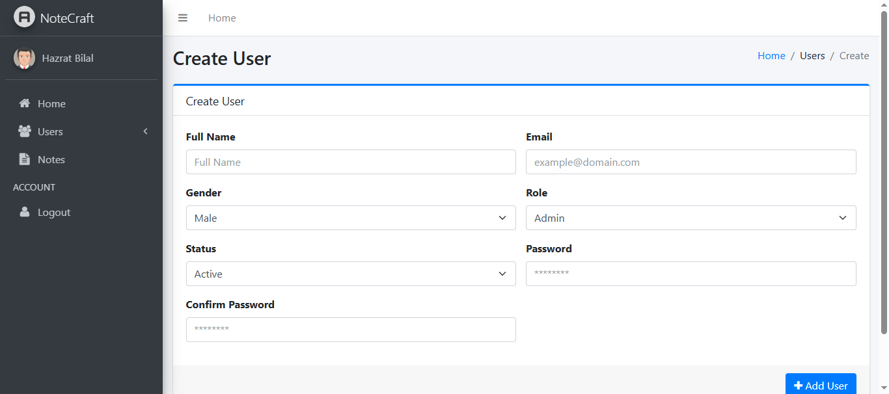
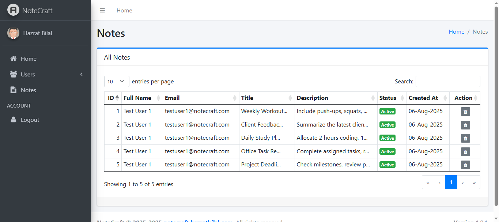

# 🌐 **NoteCraft Web (Admin Dashboard + API)**
> 📝 A **web-based management dashboard and API backend** for the **NoteCraft mobile apps**, built with **CodeIgniter (PHP)**.  
> This project provides **JWT-secured REST APIs** for Android apps and a powerful **AdminLTE dashboard** for managing users and monitoring notes.

 

## 🚀 **Features**
- 🔐 **JWT Authorization** – Secure API authentication for mobile and web clients  
- 📡 **RESTful APIs** – Secure backend endpoints for user authentication, account and notes management with mobile apps 
- 👨‍💼 **Admin Dashboard (AdminLTE)** – Easy-to-use interface for managing the platform  
- 👥 **User Management** – Create, update, view, and delete user accounts  
- 📝 **Notes Management** – View and delete notes created by app users  
- 📊 **Responsive UI** – Dashboard optimized for desktop and mobile browsers  

 

## 🛠 **Tech Stack**
- **Framework:** CodeIgniter (PHP)  
- **Authentication:** JWT (JSON Web Tokens)  
- **Frontend:** AdminLTE (Bootstrap-based admin template)  
- **Database:** MySQL  
- **API Architecture:** RESTful APIs for mobile app integration  
- **Security:** Password hashing, token-based access, and secure endpoints  

 

## 📱 **Modules Overview**
| Module              | Description                                                       |
|----------------------|------------------------------------------------------------------|
| **Login**            | Admin authentication using JWT                                   |
| **Dashboard**        | Overview of users and notes statistics                           |
| **User Management**  | Create, edit, view, and delete users                             |
| **Notes Management** | View and delete user-created notes                               |
| **API Endpoints**    | Provide secure APIs for mobile apps to interact with the backend |

 

## 📦 **Setup Instructions**
1. Clone the repository  
2. Import the database schema provided in `/database` folder  
3. Configure database credentials in `application/config/database.php`  
4. Set base URL in `application/config/config.php`  
5. Run the project on your local server (Apache/Nginx)  
6. Access the **Admin Dashboard** via: 
    **URL:** `http://localhost/notecraft/` 
    **Email:** `admin@notecraft.com` 
    **Password:** `admin`  
8. Use the provided **API endpoints** for mobile app integration

 

## 📱 Screenshots
| Dashboard | Create User | View Users | View Notes |
|-----------|-------------|------------|------------|
|  |  |  |  |

 

## 🧑 **Author**
**Hazrat Bilal**  
- [**LinkedIn**](https://linkedin.com/in/hazrat-bilal-24672817a/)  
- [**Portfolio**](https://hazratbilal.com/)
 
